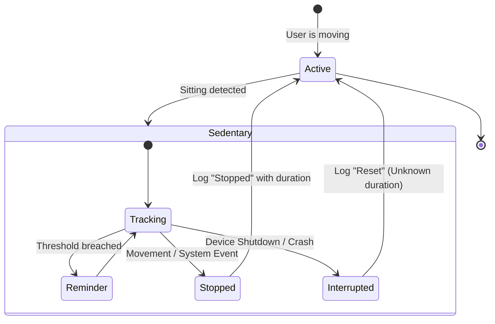

# Smartr

Smartr is a Wear OS application designed to monitor sedentary behavior and encourage movement through intelligent reminders and a vitality-based XP system.

## Event Tracking & Reconciliation

Smartr uses an event-based log to track your daily behavior. This ensures that every session is recorded accurately, even in high-interruption environments like a smartwatch.

### Behavior Lifecycle

### Event Types
- **SEDENTARY_START**: Logged when movement stops.
- **REMINDER_SENT**: Logged when a sedentary threshold is breached.
- **SEDENTARY_STOPPED**: Logged when the user moves or a system event (Sleep/Exercise/Wrist-off) occurs. Includes final duration.
- **SEDENTARY_RESET**: Logged upon app restart if a previous session was interrupted (e.g., battery death). This indicates an unknown duration to preserve data integrity.

## Technical Guidelines
Refer to [AGENTS.md](AGENTS.md) for project conventions and technical rules.
