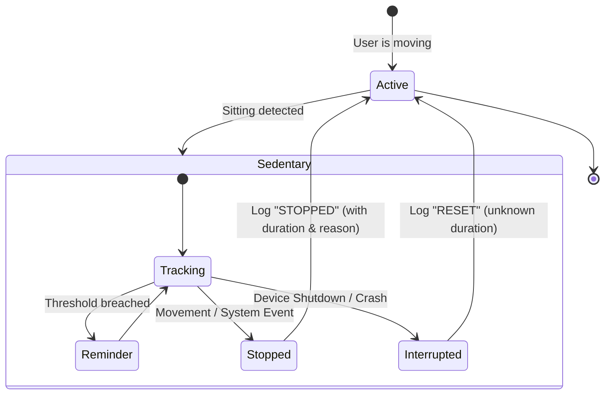

# Smartr

Smartr is a Wear OS application designed to monitor sedentary behavior and encourage movement through intelligent reminders and a vitality-based XP system.

## Event Tracking & Reconciliation

Smartr uses an event-based log to track your daily behavior. This ensures that every session is recorded accurately, even in high-interruption environments like a smartwatch.

### Behavior Lifecycle

Smartr implements a professional **Events Architecture** using RFC3339 timestamps and JSON metadata for high-precision behavior auditing.

### Event Schema
All events flow into a unified `events` table:
- **type**: `SEDENTARY_START`, `SEDENTARY_STOPPED`, `REMINDER_SENT`, `SEDENTARY_RESET`.
- **timestamp**: RFC3339 string (e.g., `2023-10-25T14:30:00Z`).
- **sessionId**: UUID linking all events in a single behavior session.
- **metadata**: JSON payload for dynamic data (duration, closure reason).

## Technical Guidelines
Refer to [AGENTS.md](AGENTS.md) for project conventions and technical rules.
